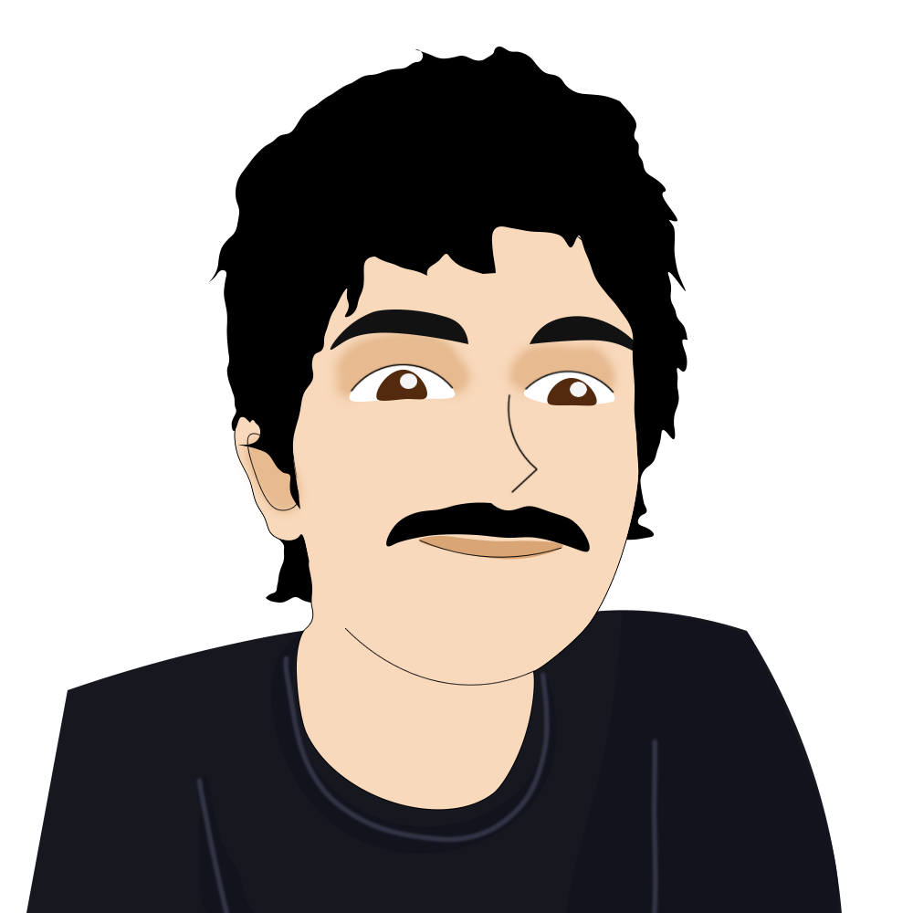

## Hi, I'm Aditya 

 
 

- 🛠 &nbsp;Learning and building new things everyday.
- 🐍 Explored python through web development, machine learning, internet of things and databases.
- 🎓 Bachelor of Technology in Computer Science Engineering.
- 🏠 Born and raised in Aurangabad, MH, India

### Connect with me

[][youtube]&nbsp;&nbsp;[][website]&nbsp;&nbsp;[][twitter]&nbsp;&nbsp;[][linkedin]&nbsp;&nbsp;[][instagram]&nbsp;&nbsp;[][steam]

 

[website]: https://adityaborgaonkar.github.io
[twitter]: https://twitter.com/adib0rg
[youtube]: https://www.youtube.com/channel/UCuTUKfty8CQtWibZuiBXLzg
[instagram]: https://instagram.com/adib0rg
[linkedin]: https://linkedin.com/in/adityaborgaonkar
[steam]: https://steamcommunity.com/id/adib0rg/
